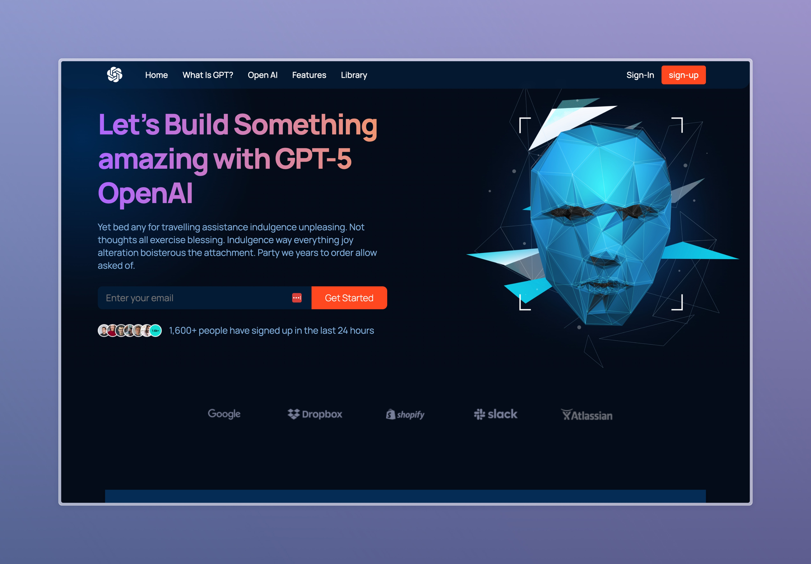

# React Website - ReactPlayground: Leveling Up My React Skills



This repository contains the source code for a React website project. The website is live and can be accessed [here](https://meslall.github.io/react-p1/).

## Overview

This project aims to demonstrate the implementation of a React website with a focus on modern web development practices. It covers various aspects including React functional components, file and folder structure, CSS styling using flexbox and grid, CSS BEM Model, animations, responsive design with media queries, and deployment to fast servers with custom domain configuration.

## Features

- **React Components**: Utilizes React functional components for building reusable UI elements.
- **File Structure**: Follows a well-organized file and folder structure for better maintainability.
- **CSS Styling**: Implements CSS styling using flexbox and grid for layout management and design.
- **CSS BEM Model**: Adheres to the CSS BEM (Block Element Modifier) methodology for scalable and maintainable CSS code.
- **Animations**: Incorporates soft animations to enhance user experience.
- **Responsive Design**: Ensures responsiveness across various devices through strategically placed media queries.
- **Deployment**: Deployed to extremely fast servers with a custom domain name for optimal performance.

## Usage

To run this project locally, follow these steps:

1. Clone this repository to your local machine:

   ```bash
   git clone https://github.com/yourusername/your-repository-name.git
   ```

2. Navigate into the project directory:

   ```bash
   cd your-repository-name
   ```

3. Install dependencies:

   ```bash
   npm install
   ```

4. Start the development server:

   ```bash
   npm start
   ```

5. Open your browser and visit [http://localhost:3000](http://localhost:3000) to view the website.

## Feedback and Contributions

If you have any feedback, suggestions, or would like to contribute to this project, please feel free to open an issue or submit a pull request. Your contributions are highly appreciated!
